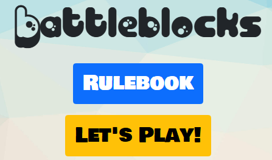
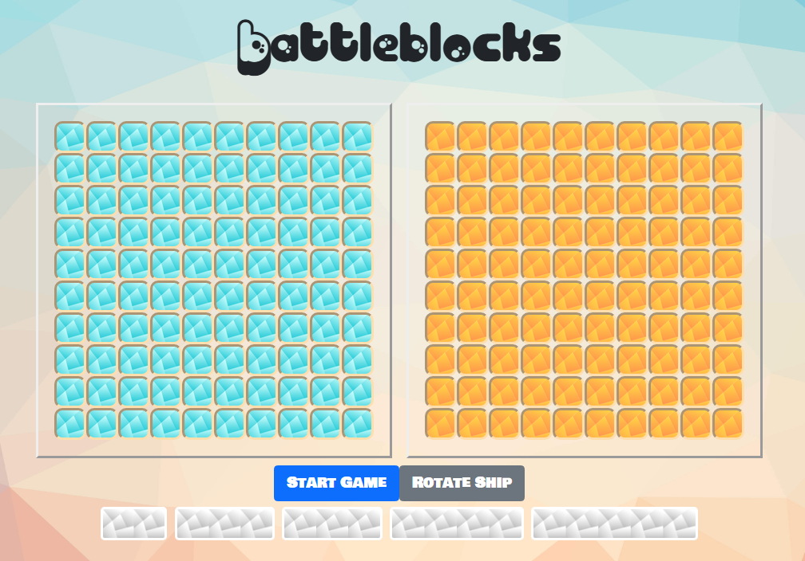

## Battleblocks

  
   
 

⚠️ Work in progress ⚠️
Here's my take on a Battleships clone. I first made this as a sophomore in college, and I've recently updated it to make the code cleaner and more readable.

It features fun music, sound effects, and feedback on each move, from the player and PC.

<video src="./images/demo.mp4" width="320" height="240" controls style="display: flex;    margin:auto;"></video>

## Known Issues

- The rotate ships feature is not working. The ships are placed in a horizontal orientation by default.
- When placing ships in a valid location, the game registers the ship as placed, removes it from your list of available ships, but fails to update the board.
- The miss sound does not play.

## Roadmap

- Fix ship placement during setup.
- Fix ship rotation issues during setup.
- Fix miss sound not playing.
- Train an AI to play against (the current one is not very smart)
- Make the game responsive on mobile screens.

## Credits

Music and Sounds: https://www.apmmusic.com/
Images: https://unsplash.com/
